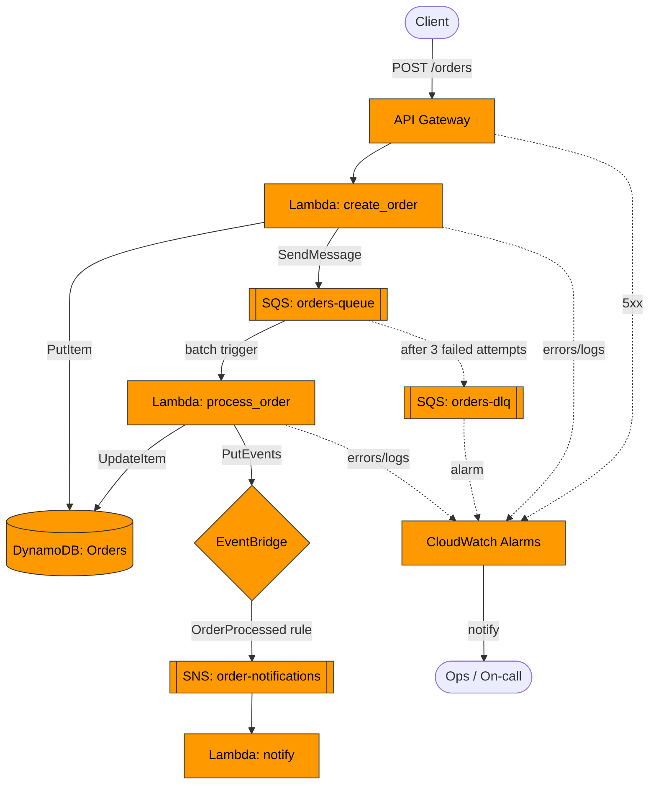

# Architecture Diagram

```mermaid
flowchart TD
    Client([Client]) -->|POST /orders| APIGW[API Gateway]
    APIGW --> CreateOrder[Lambda: create_order]
    CreateOrder -->|PutItem| DDB[(DynamoDB: Orders)]
    CreateOrder -->|SendMessage| Queue[[SQS: orders-queue]]

    Queue -->|batch trigger| ProcessOrder[Lambda: process_order]
    Queue -.->|after 3 failed attempts| DLQ[[SQS: orders-dlq]]

    ProcessOrder -->|UpdateItem| DDB
    ProcessOrder -->|PutEvents| EB{EventBridge}

    EB -->|OrderProcessed rule| SNS[[SNS: order-notifications]]
    SNS --> Notify[Lambda: notify]

    DLQ -.->|alarm| CW[CloudWatch Alarms]
    ProcessOrder -.->|errors/logs| CW
    CreateOrder -.->|errors/logs| CW
    APIGW -.->|5xx| CW

    CW -->|notify| Ops([Ops / On-call])

    classDef aws fill:#FF9900,stroke:#333,color:#000;
    class APIGW,CreateOrder,DDB,Queue,DLQ,ProcessOrder,EB,SNS,Notify,CW aws;
```

This diagram is also rendered automatically by GitHub when viewing this
file, since GitHub natively supports Mermaid in Markdown.
